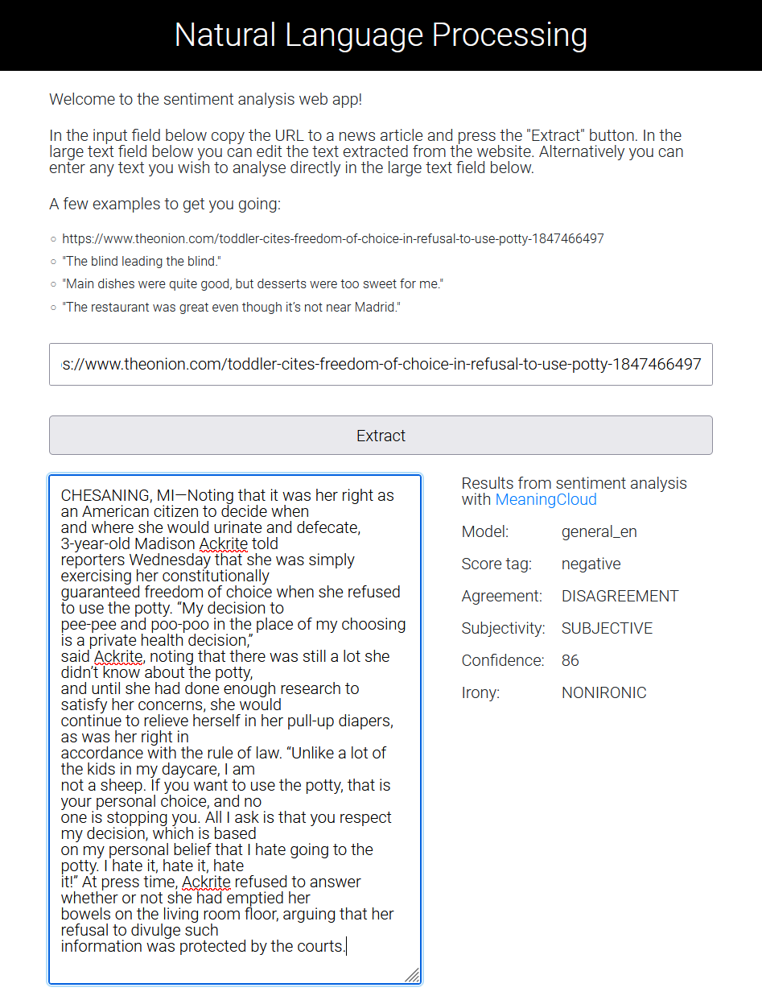

# Evaluate News Articles with Natural Language Processing 
*Udacity Front End Web Developer Nanodegree Program*

A simple web app to analyse the content of a news article with natural language processing. The 
user provides the URL to the article in the web form. The article content is analysed and the 
results are shown. The project demonstrates the use of build tools such as webpack for a front end
development project.

<p align="center">
  
</p>
<p align="center"><em>Sample screenshot</em></p>

## Project installation

Run the following commands to clone and run the project. All commands are for the 
Windows 10 operating system:

```shell
git clone https://github.com/SophonAlpha/Udacity-FEND-Project-Natural-Language-Processing.git
cd Udacity-FEND-Project-Natural-Language-Processing
npm install
```

Before you can run the tests or the application you need to configure your own [MeaningCloud API 
key](https://www.meaningcloud.com/developer/create-account). The key is stored in `.\src\server\.
env`. The file is read by the Node.js server at runtime.
The file has been excluded from the GitHub repository as it contains a personal API key.

To create an `.env` file with your own API key copy the template file:

```shell
copy src\server\.env_tmpl src\server\.env
```

Open the `.env` file a text editor and enter your API key:

```shell
// MeaningCloud API

apiUrl=https://api.meaningcloud.com/sentiment-2.1
apiKey=<ADD YOUR API KEY HERE>
```

Build the project in development mode:

```shell
npm run build-dev
```

Run the tests:

```shell
npm run test
```

To start the application on the webpack DevServer:

```shell
npm run start-dev
```

Start the application on the local Node.js server:

```shell
npm run node-dev
```

This will start the Node.js server and automatically open the application in your web browser.

## Appendix - Impact of webpack modes `development` vs `production`

With the webpack `mode: 'production'` setting the number and size of the application files will be  
significantly reduced.

Number and size of files in development mode:

```shell
21/08/2021  13:41    <DIR>          .
21/08/2021  13:41    <DIR>          ..
21/08/2021  13:41            10,355 bundle.js
21/08/2021  13:41            12,586 bundle.js.map
21/08/2021  13:41               766 favicon.ico
21/08/2021  13:41             4,540 index.html
21/08/2021  13:41             3,588 main.css
21/08/2021  13:41             4,336 main.css.map
21/08/2021  13:41             3,606 service-worker.js
21/08/2021  13:41             2,175 service-worker.js.map
21/08/2021  13:41           118,642 workbox-f96f0f89.js
21/08/2021  13:41           195,196 workbox-f96f0f89.js.map
              10 File(s)        355,790 bytes
```

Number and size of files in production mode:

```shell
21/08/2021  13:43    <DIR>          .
21/08/2021  13:43    <DIR>          ..
21/08/2021  13:43             3,506 bundle.js
21/08/2021  13:43               766 favicon.ico
21/08/2021  13:43             3,637 index.html
21/08/2021  13:43             2,099 main.css
21/08/2021  13:43             1,202 service-worker.js
21/08/2021  13:43            13,938 workbox-2fdebd44.js
               6 File(s)         25,148 bytes
```

## Appendix - Useful readings used during the project:

- [MeaningCloud](https://www.meaningcloud.com/)
- [Webpack Guidelines](https://webpack.js.org/guides/development/)
- [Requiring modules in Node.js: Everything you need to know](https://www.freecodecamp.org/news/requiring-modules-in-node-js-everything-you-need-to-know-e7fbd119be8/)
- [Jest Tutorial for Beginners: Getting Started With JavaScript Testing](https://www.valentinog.com/blog/jest/)
- [Testing with Node, Jest, and JSDOM](https://freecontent.manning.com/testing-with-node-jest-and-jsdom/)
- [Testing Asynchronous Code](https://jestjs.io/docs/asynchronous)
- [Jest Fetch Mock](https://www.npmjs.com/package/jest-fetch-mock#mocking-multiple-fetches-with-different-responses)
- [How To Mock Fetch in Jest | Leigh Halliday](https://www.leighhalliday.com/mock-fetch-jest)
- [How to test Express.js with Jest and Supertest](https://www.albertgao.xyz/2017/05/24/how-to-test-expressjs-with-jest-and-supertest/)
- [The only 3 steps you need to mock an API call in Jest](https://zaklaughton.dev/blog/the-only-3-steps-you-need-to-mock-an-api-call-in-jest/)
- [Service Workers: an Introduction](https://developers.google.com/web/fundamentals/primers/service-workers/)
- [Generate a Service Worker with Webpack](https://developers.google.com/web/tools/workbox/guides/generate-service-worker/webpack)
- [Deploying Node.js applications to Elastic Beanstalk](https://docs.aws.amazon.com/elasticbeanstalk/latest/dg/create_deploy_nodejs.html)
